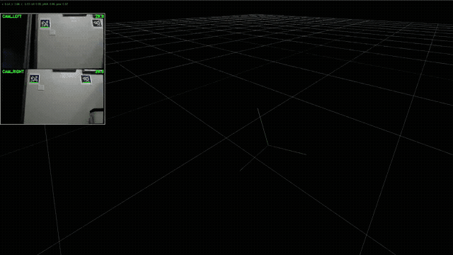

Overview
###########

.. important::
    This project is under active development!

Multicamera Apriltag Pose Localization and Estimation (MAPLE) is a position estimator that uses the known location of
`Apriltag <https://github.com/AprilRobotics/apriltag>`_ fiducials
to estimate the orientation (or pose) of a robot in 3D space. Multiple cameras are used to increase pose accuracy
and reduce blindspots as the cameras move around in the world. This software stack is geared towards FRC FIRST robotics
competitions, but can be configured for general Apriltag localization applications.

Compared to existing FRC camera solutions (such as `Limelight <https://docs.limelightvision.io/>`_ or `PhotonVision <https://docs.photonvision.org>`_), MAPLE is designed specifically for multicamera
setups and aims to minimize the technical barrier of entry for multicamera pose localization.

Bring your own hardware, or use the recommended specs (3 cameras, RPi 5, totalling <$300).

Features
=========

* Realtime multicamera (3+) Apriltag pose localization
* Web UI camera and pose visualization
* Camera distortion correction
* Onboard pose trajectory logging
* Compatable with Limelight ``fmap`` Apriltag field layout files
* Easy installation with Docker compose
* FRC getting started code examples
* Fully documented API
* Stream data over NetworkTables (FRC) or WebSockets

Installation
==============

1. :doc:`installation/choosing-hardware`
2. :doc:`installation/setup-system`
3. :doc:`installation/install`
4. :doc:`installation/configure`
5. :doc:`installation/run`

FAQ
====

Q: How many cameras can MAPLE handle at once?

    A: There are no hard limits within MAPLE. On a Raspberry Pi 5 8GB MAPLE can process 4 cameras at 640p @ 60FPS in realtime.

Q: What cameras and computer should I use?

    A: See the discussion on :doc:`installation/choosing-hardware` to pick the cameras and coprocessor to best suit your needs.

Q: Why should I use this instead of Limelight or PhotonVision?

    A: MAPLE is designed for high performance multi-camera pose estimation without sacrificing ease of use or accuracy. Limelight
    and PhotonVision are focused on single-camera Apriltag pose estimation.

.. toctree::
   :maxdepth: 2
   :hidden:

   self
   installation/index
   calibration
   api/index
   contributing/index
