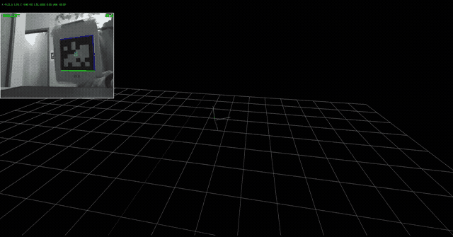
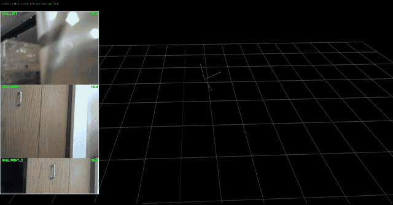
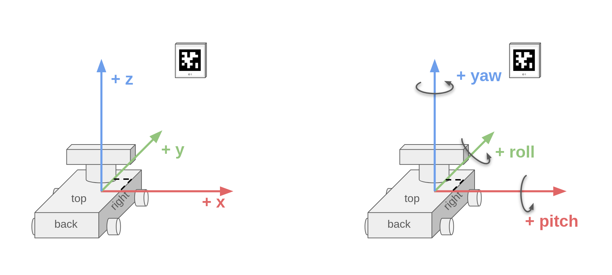
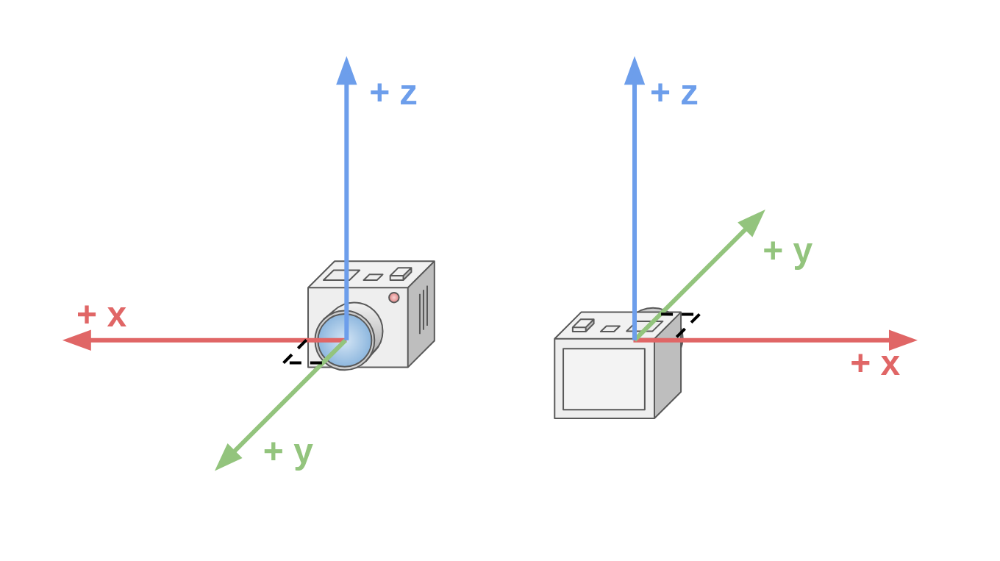
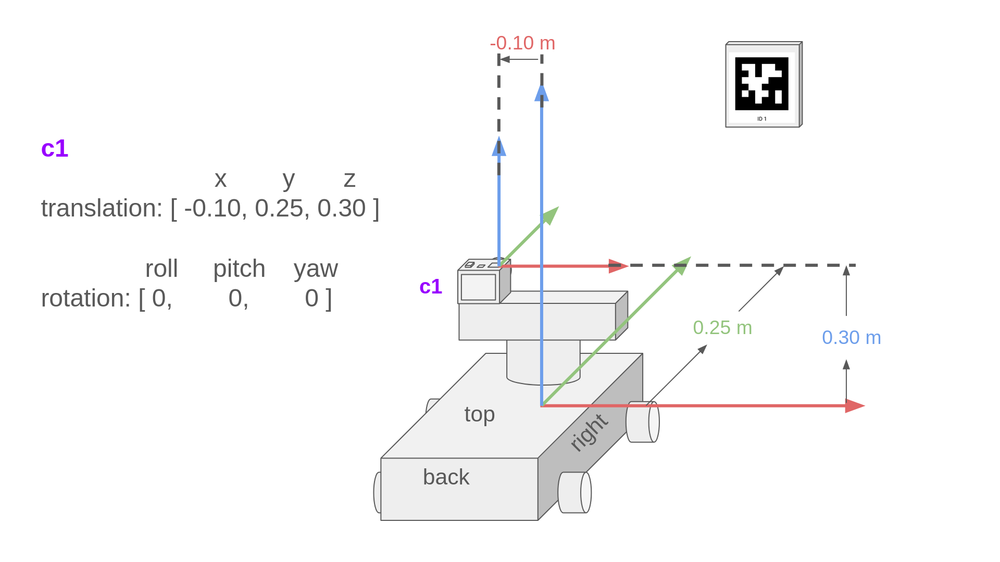
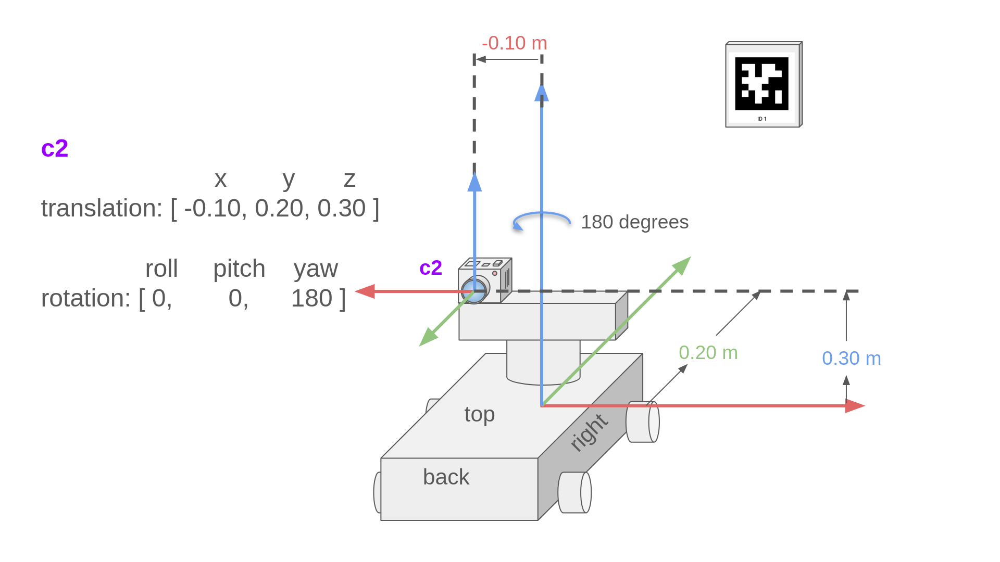
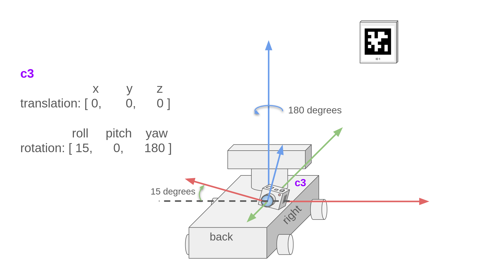

Calibrate & configure your cameras
####################################

In order for AMPL to calculate the location of your robot in 3D space, it must know exactly where your cameras are located
on the robot. Additionally, typical camera lenses introduce distortion into your images, and will cause your pose estimates
to be incorrect if this is not accounted for.

This section goes over the ``config.yml`` file which you will edit to exactly describe where each camera is located on the
robot, how much distortion there is for each camera, what resolution/framerate to run each camera at, and so on. You will
have the following ``config.yml`` template in the ``~/ampl-config`` folder on your coprocessor:

.. code-block:: yaml

   # Configuration file for AMPL

   team_number: -1
   pose_logging: true

   cameras:
   # front left
     CAM_LEFT:
       # maps to /dev/video4
       camera_id: 4
       rx: 544
       ry: 288

       # focal length (in pixels)
       fx: 590.588
       fy: 543.682

       # center of the camera image (in pixels)
       cx: 279.683
       cy: 136.174
       dist_coeffs: [ 0.0814261, -0.0272061, -0.00493096, 0.00292767, 0.799907 ]

       # Camera x, y, z location on the robot, in meters
       translation: [-0.10, 0, 0]

       # Camera roll, pitch, yaw orientation on the robot, in degrees
       rotation: [0, 0, 0]

       fps: 30.0
       exposure: 1

   # front right
     CAM_RIGHT:
       # maps to /dev/video6
       camera_id: 6
       rx: 544
       ry: 288

       # focal length (in pixels)
       fx: 590.588
       fy: 543.682

       # center of the camera image (in pixels)
       cx: 279.683
       cy: 136.174
       dist_coeffs: [ 0.0814261, -0.0272061, -0.00493096, 0.00292767, 0.799907 ]

       # Camera x, y, z location on the robot, in meters
       translation: [0.10, 0, 0]

       # Camera roll, pitch, yaw orientation on the robot, in degrees
       rotation: [0, 0, 0]

       fps: 30.0
       exposure: 1

Select camera devices
========================

AMPL must know which camera devices that you have plugged into your coprocessor should be used for Apriltag detection.

First, connect all of your cameras to your coprocessor, then reboot the device.

.. warning::

   AMPL uses video device IDs (or names, such as ``/dev/videoXX``) to map cameras for its pose calculations. Video device IDs typically stay
   consistent through reboots, but isn't guaranteed.

Next, run the following command in a terminal connected to the coprocessor:

.. code-block:: bash

   sudo v4l2-ctl --list-devices

This will display all video capture devices connected to your coprocessor and their associated video device IDs. The first
ID listed for each camera is typically the one that will open the main video capture. For example, we can see there are
4 cameras connected to our coprocessor in the following output:

.. code-block:: bash

   C505e HD Webcam (usb-0000:01:00.0-1.1):
        /dev/video0
        /dev/video1
        /dev/media4

   Arducam OV9281 USB Camera: Ardu (usb-0000:01:00.0-1.2):
        /dev/video2
        /dev/video3
        /dev/media5

   C505e HD Webcam (usb-0000:01:00.0-1.3):
        /dev/video4
        /dev/video5
        /dev/media6

   C505e HD Webcam (usb-0000:01:00.0-1.4):
        /dev/video6
        /dev/video7
        /dev/media7

For each camera, we can see what the supported framerates and resolutions are with the following command. Use the first
video ID for the camera you'd like to inspect.

.. code-block:: bash

   sudo v4l2-ctl --device /dev/video0 --list-formats-ext

We're interested in the ``MPJEG`` section:

.. code-block:: bash

    [1]: 'MJPG' (Motion-JPEG, compressed)
        Size: Discrete 640x480
            Interval: Discrete 0.033s (30.000 fps)
            Interval: Discrete 0.040s (25.000 fps)
            Interval: Discrete 0.050s (20.000 fps)
            Interval: Discrete 0.067s (15.000 fps)
            Interval: Discrete 0.100s (10.000 fps)
            Interval: Discrete 0.200s (5.000 fps)
        Size: Discrete 160x120
            Interval: Discrete 0.033s (30.000 fps)
            Interval: Discrete 0.040s (25.000 fps)
            Interval: Discrete 0.050s (20.000 fps)
            Interval: Discrete 0.067s (15.000 fps)
            Interval: Discrete 0.100s (10.000 fps)
            Interval: Discrete 0.200s (5.000 fps)
        Size: Discrete 176x144
            Interval: Discrete 0.033s (30.000 fps)
            Interval: Discrete 0.040s (25.000 fps)
            Interval: Discrete 0.050s (20.000 fps)
            Interval: Discrete 0.067s (15.000 fps)
            Interval: Discrete 0.100s (10.000 fps)
            Interval: Discrete 0.200s (5.000 fps)
        ....

Since multiple cameras attached to our coprocessor are the same model,
we will need to do some trial and error to figure out which camera is which. Start by adding a camera entry in your ``config.yml``
file and assign it a ``camera_id`` (**use the first video ID** in the list). Set your desired resolution, framerate, and
you may use placeholder ``fx``, ``fy``, ``cx``, and ``cy`` values.

.. code-block:: yaml

   # Configuration file for AMPL

   team_number: -1
   pose_logging: true

   cameras:
   # front left
     CAM_LEFT:
       # maps to /dev/video0
       camera_id: 0

       rx: 544
       ry: 288

       # placeholder values until calibration is run
       fx: 600
       fy: 600
       cx: 272
       cy: 144

Restart AMPL, then navigate to the webUI at `http://ampl.local:8080 <http://ampl.local:8080>`_.

On the left side, you should see a live video feed. Verify the camera image is coming from the desired camera. If the video
feed is coming from the wrong camera, modify your ``config.yml`` to change either the camera name or ``camera_id`` so it
maps to the correct camera.

Repeat this process for each camera.

.. note::

   Once all cameras have been sucessfully added, completely power off your coprocessor, turn it back on, and verify each
   camera feed is coming from the correct source.

Calibrate cameras
==================

Camera calibration is not required but is easy to setup and recommended for accurate pose estimation. See :doc:`../calibration` for
instructions and details.

Set camera positions and orientations
=======================================

Each camera in the ``config.yml`` file must have a translation and rotation set which specifies where the camera is mounted
**relative to the center of the robot**. Translation and rotation are measured in meters and degrees respectively. Let's step through
figuring out the translation and rotation of a camera in a few examples.

The image below describes the **robot frame**, which is at the center of the robot. A "frame" is a point of view and we
setup an axis system (x, y, z here) at the center of the frame. We will make all measurements relative to this frame of reference.

Each of your cameras also have their own **camera frame**, which you can see below. The center of the camera frame is at
the **center of the camera lens**.

In this first example, the camera frame **c1** is not rotated at all, but is translated forwards, up, and to the left of the
center of the robot. We measure how the camera frame **c1** moved **relative to the robot frame**. In this case, it moved
positive 0.25 meters forwards along the Y axis, positive 0.3 meters up along the Z axis, and negative 0.10 meters left on the
X axis. Since the positive direction of the robot's X axis is to the right, and the camera is to the left, the measurement
must be negative.

In the second example, the camera frame **c2** is in the same location (almost) as the first example, but it has rotated 180
degrees so it is looking backwards. Notice that the Y translation value has changed by 0.05 meters. Since the camera rotated
in place and we measure from the camera lens, the camera frame has actually moved backwards 0.05 meters relative to the robot frame.

In the third example, the camera is located at the center of the robot, looking backwards, and is tilted 15 degrees.
The same 180 degree rotation still applies, but now we must measure the tilt of the camera relative to the robot frame.

We can see that the camera is not pitched forwards or backwards relative to the robot frame, but is tilted 15 positive
degrees in the roll direction relative to the robot.

.. note::
   **All rotation and translation measurements are relative to the robot frame (robot center)**. For example, if you point
   a camera up 45 degrees (+45 degree pitch relative to the camera frame), but the camera is pointed left on the robot,
   this is actually a +45 degree roll and +90 degree yaw.

All ``config.yml`` parameters
===============

AMPL Parameters
~~~~~~~~~~~~~~~~~~~~~

.. list-table::
    :widths: 25 55 5 15
    :header-rows: 1
    :class: tight-table

    * - Parameter name & type
      - Description
      - Required (Y/N)
      - Default value

    * - team_number - ``int``
      - The FRC team number. Used to connect AMPL to NetworkTables. If no number is supplied, AMPL will not attempt to
        connect to NetworkTables.
      - N
      - ``-1``

    * - fmap_file - ``string``
      - The path to the ``.fmap`` file describing the locations of the Apriltags in the world in the docker container. Change the
        contents of the field.fmap file on the host machine instead of this path.
      - N
      - ``../fmap/field.fmap``, containing the FRC 2024 Crescendo field layout.

    * - video_recording - ``bool``
      - Write camera frames to .mp4 video files. This will disable Apriltag detection.
      - N
      - ``false``

Camera Parameters
~~~~~~~~~~~~~~~~~~~~~

.. warning::

   Some cameras have firmware that do not let you manually set FPS and/or exposure. In these cases, the FPS/exposure will depend
   on the lighting conditions when AMPL first starts. See :doc:`./choosing-hardware` for details.

.. list-table::
    :widths: 25 55 5 15
    :header-rows: 1
    :class: tight-table

    * - Parameter name & type
      - Description
      - Required (Y/N)
      - Default value

    * - camera_id - ``string``
      - The camera device ID identified by the OS. You can find this value in ``/dev/videoX``, where ``X`` is the ``camera_id``
        value that is desired for this parameter.
      - Y
      - N/A

    * - camera_playback_file - ``string``
      - Open a .mp4 video file instead of a camera device to run Apriltag detection on. Specifies the path to the .mp4 file.
      - N
      - ``""``

    * - rx - ``int``
      - The desired camera resolution X. Will use the closest available resolution.
      - Y
      - N/A

    * - ry - ``int``
      - The desired camera resolution Y. Will use the closest available resolution.
      - Y
      - N/A

    * - calibrate - ``bool``
      - Enable calibration mode on this camera. Use a 9x6 chessboard calibration target to calculate the camera intrinsic
        matrix (fx, fy, cx, cy) and the distortion coefficients. If values for fx, fy, cx, and cy are provided in the configuration
        file, use these as the initial guess for the camera intrinsic matrix during the calculation. Camera closes after calibration is complete.
      - N
      - ``false``

    * - fx - ``double``
      - The focal length (in pixels) for x. fx = pixels/mm * focalLength_mm. Can be calculated by the calibration routine.
      - Y
      - N/A

    * - fx - ``double``
      - The focal length (in pixels) for y. fy = pixels/mm * focalLength_mm. Can be calculated by the calibration routine.
      - Y
      - N/A

    * - cx - ``double``
      - The center of the image in the x axis in pixels. Can be calculated by the calibration routine.
      - Y
      - N/A

    * - cy - ``double``
      - The center of the image in the y axis in pixels. Can be calculated by the calibration routine.
      - Y
      - N/A

    * - dist_coeffs - ``vector<double>``
      - The distortion coefficients to undistort the image. Run the calibration routine to calculate these values.
      - N
      - ``{}``

    * - fps - ``double``
      - The desired FPS to set the camera to. If the camera doesn't support the specified FPS, the closet supported framerate
        will be used. If the FPS is too high and data cannot be processed fast enough, the camera may run at a lower FPS.
      - Y
      - N/A

    * - exposure - ``int``
      - The desired camera exposure. Range varies per camera. Lower values mean less exposure time and darker images.
      - Y
      - N/A

.. toctree::
   :maxdepth: 1
